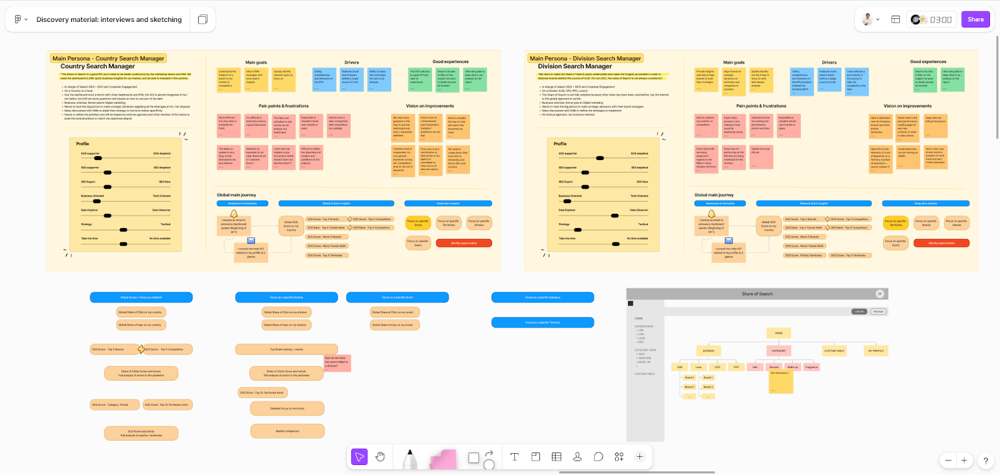
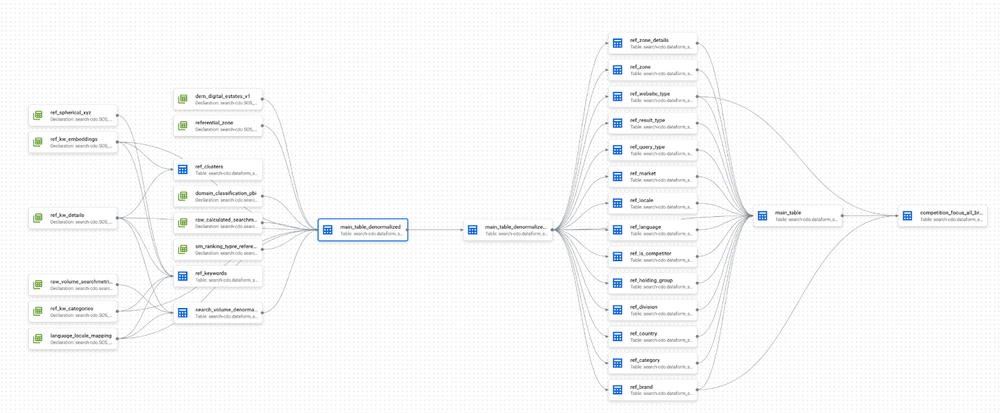

# 1.2.2 Compétences Produit du Product Builder

Si la maîtrise technique donne au Product Builder sa capacité à construire, c'est son product mindset qui lui donne la capacité de construire la meilleure solution pour le business et les utilisateurs, qu’il s’agisse d’IA ou non. 

Cette mentalité n'est pas un simple ensemble de compétences, mais une culture, une obsession pour la valeur et l'utilisateur. Elle repose sur un socle de principes et de méthodes partagés par les PM. Il n’est pas ici question d’en faire une liste exhaustive, mais d’en présenter les principales.

**La vision stratégique, pour définir le cap à suivre**

Une vision bien définie et partagée à tous les stakeholders doit guider chaque décision et aligner les équipes. C’est elle qui permet de dire non aux bonnes idées qui ne servent pas l'objectif final et d'éviter l’écueil des listes de features sans fin.

Le Product Builder doit savoir formuler et communiquer une vision produit claire, inspirante et directement liée aux objectifs de l'entreprise. Une méthode à privilégier pour y parvenir peut être le “Product Vision Board”, un canevas simple qui permet de capturer la vision sur une seule page. 

**→ Un exemple concret : le “Product Vision Board” d’un produit SaaS incorporant des features IA dans le retail**

Pour le compte d’un acteur du retail, Converteo a conçu une plateforme SaaS destinée à ses fournisseurs. Pour bien démarrer la mission, il était important de s’assurer de l’alignement des parties prenantes sur le pourquoi de ce produit, mais également sur ce qui en ferait un succès.

Un atelier a donc été mené avec comme livrable :

- Un canevas simple mais qui a été le fruit de multiples discussions pour obtenir le pourquoi de ce produit, sa cible, les problèmes que l’on cherche à résoudre et les contours de la solution.

- Un framework de KPIs afin de mesurer le succès futur du produit. Souvent mal maîtrisé, il a fallu bien différencier les objectifs projet initiaux (budget, planning, qualité) des objectifs Product.

A l’issue de ce travail, la Product Vision pour les vendeurs prenait par exemple cette forme :

> ***“Pour*** *les vendeurs,*

> ***Qui souhaitent*** *bénéficier de la visibilité du retailer afin de distribuer leurs produits en ligne sur le site internet,*

> ***Notre solution est*** *un outil de gestion du catalogue produits dédié à la marketplace* 

> ***Qui*** *permet de simplifier grandement toutes les démarches de gestion du catalogue pour se focaliser sur l’optimisation des ventes et d'améliorer le volume de vendeurs inscrits, de produits vendus et de marchés ciblés*

> ***Contrairement à*** *la solution existante ou une solution du marché*

> ***Notre produit*** *leur offrira une expérience améliorée de connexion et de gestion des droits, de mise à jour du catalogue grâce à l’IA, une simplification des fonctionnalités de suivi et à l’intégration technique aux autres outils du groupe pour fluidifier les étapes de validation et de mise à disposition des produits pour les clients finaux.”*

Quant aux **KPIs du produit (et non du projet)**, ils étaient les suivants :

> *Objectif 1 : améliorer le catalogue de produits proposés via la marketplace*

> *Key result 1 : avoir 50% des produits du catalogue de chaque vendeur disponible en ligne*

> *Key result 2 : doubler le taux de validation des fiches produits* 

> *Key result 3 : augmenter de 30% le volume de produits ayant l’ensemble des attributs non-obligatoires remplis*

> *Objectif 2 : améliorer le time-to-market des produits de la marketplace*

> *Key result 1 : réduire de 20% le volume de demandes remontées au service support*

> *Key result 2 : atteindre une moyenne de 5 jours ouvrés entre le partage d’une nouvelle fiche produit et le positionnement d’une offre vendeur pour proposer le produit en vente sur la marketplace*

**La "double discovery", pour valider la désirabilité et la faisabilité**

Le Product Builder, en tant que “product people”, sait définir les besoins et problèmes de ses utilisateurs grâce à des insights et de ***Jobs-to-be-Done***. Ils sont formalisés grâce à la combinaison des data quantitatives (pour déterminer le “où” et le “quoi” grâce à des outils tels qu’Amplitude ou GA4) et qualitative (pour déterminer le “pourquoi”, grâce à des interviews utilisateurs par exemple).

Cette première phase liée à l’**UX Research** permet de prioriser un premier niveau de backlog de problèmes à résoudre en mariant ces insights avec les expressions du besoin du métier. Cela étant, il peut partir dans une deuxième phase d'idéation en combinant workshop de co-création avec des experts et des outils de GenIA. Puis de partir dans la troisième phase dite de “double discovery”.

Dans le contexte de création de nouveau produit ou de nouvelle feature IA, cette exploration doit en effet se faire sur deux fronts parallèles, avec **une investigation rigoureuse capable de** **valider à la fois la désirabilité (le problème utilisateur) et la faisabilité (la viabilité technique et data)**. 

Cette double discovery permettra donc de dérisquer le troisième pilier d’un produit : **la rentabilité**. Ainsi, la double discovery peut permettre d’éviter de développer une feature au sein d’un MVP qui ne serait pas utilisée et dont le passage à l'échelle engendrerait des coûts exponentiels.

Ici, les compétences clés à maîtriser tiennent à la fois à la **business analyse** et à l’**UX research**. Mais elles incluent aussi des dimensions plus techniques, comme la maîtrise du *vibe coding* et du design de tests utilisateurs, qui permettent de créer un prototype sous forme de parcours complexe bien plus rapidement qu’avec les outils de design classique, tels que Figma.

Du point de vue des méthodes, les *User Interviews* constituent le socle de cette phase de découverte, tandis que l'*Empathy Map* aide à synthétiser ce que l'utilisateur dit, pense, ressent et fait, pour passer de l'observation à l'insight.

**→ Un exemple concret : proto-persona et Customer journey pour un produit de data visualisation boosté à l’IA**

Dans le cadre d’une mission pour un leader du secteur de la beauté, Converteo devait accompagner la direction search pour concevoir, designer et développer un nouveau framework de KPIs et les outils de data visualisation associés. Plutôt que de se jeter uniquement sur les données déjà existantes et disponibles, les équipes en charge du projet ont décidé de prendre un temps de cadrage central afin de bien comprendre les attentes des différents utilisateurs, du top management aux acteurs opérationnels.

***User Research - Persona & Story mapping***

Plusieurs interviews ont été menées sur la base d’un guide d’entretien semi-dirigé afin de construire des proto-persona qui ont été mis au centre de toutes les réflexions. Les attentes étaient en effet très différentes selon les profils d’utilisateurs et ce type de mapping a permis de prioriser les sujets sur lesquels mettre plus d’énergie dans les phases de conception.

***Data Research - Data Lineage***

En parallèle de la partie recherche utilisateurs, il était évidemment essentiel de travailler sur les données. Qu’est-ce qui est disponible ? Gouverné ? Brut ou calculé ? Comment automatiser ? Quelles sont les solutions du marché ?

Tout ce travail classique pour le cadrage de projet IA a permis d’affiner les estimations de faisabilité des premières user stories.​

### **La priorisation par la valeur, ou l'art stratégique de dire non**

Par définition, les ressources sont toujours limitées. La priorisation n'est donc pas une simple gestion de liste de tâches, c'est l'exercice le plus stratégique du Product Management ! Il s'agit de faire des choix délibérés pour maximiser l'impact avec le minimum d'effort.

Ici, une compétence essentielle à développer est la capacité à évaluer et comparer des initiatives concurrentes sur la base de leur valeur potentielle et de leur coût, en utilisant des frameworks structurés pour justifier ses décisions. 

Plusieurs outils et méthodes existent pour cela, mais parfois une simple matrice **“Valeur x Effort”** peut suffire.

**→ Un exemple concret : prioriser sous pression pour lancer un assistant IA en 4 mois**

L'équipe disposait de 4 mois pour remplacer le chatbot existant d’une marque positionnée sur un segment premium/luxe, avec une deadline absolue : la date de coupure définitive du service utilisé précédemment.

Face à trois contraintes qui se superposaient (une date non négociable, un périmètre fonctionnel minimum à couvrir et l'ambition de poser des bases solides pour l'avenir), l’équipe a structuré le projet en 3 cycles itératifs :

> ***Cycle 1, la FAQ conversationnelle*** *- Un chatbot capable de répondre aux questions générales (politique de retour, délais de livraison, modes de paiement) en s'appuyant sur une base de connaissance. La valeur est immédiate pour le client, avec peu d’intégration technique complexe. Objectif : faire tester l'IA le plus tôt possible aux équipes pour les confronter au caractère non-déterministe de l'outil et valider le respect du tone-of-voice de la marque.*

> ***Cycle 2, le suivi de commande*** *- Connexion à l'OMS (Order Management System) de la marque pour permettre au chatbot de récupérer le statut d'une commande en temps réel. Ce sont les premières intégrations systèmes, et la première valeur transactionnelle.*

> ***Cycle 3, le basculement vers un agent humain*** *- Intégration avec Salesforce Service Cloud pour pouvoir transférer la conversation à un conseiller si nécessaire, avec transmission du contexte complet. C’est la fonctionnalité la plus complexe techniquement, positionnée en dernier pour sécuriser le planning.*

Cette approche incrémentale a permis de livrer de la valeur à chaque étape tout en respectant la deadline. Chaque cycle représentait un parcours client fonctionnel autonome. Si le projet n'avait pas eu à couvrir le périmètre du chatbot précédent, chaque cycle aurait pu être mis en production indépendamment.

### **La culture de l’expérimentation, ou savoir mesurer pour apprendre**

Pour un acteur du Product, la première version d'un produit n'est jamais une fin, c'est toujours le début d'un cycle d'apprentissage. Le *Product mindset* est fondamentalement scientifique : on formule une hypothèse, on construit une expérience pour la tester, on mesure les résultats, et on apprend.

Il s’agit alors de savoir définir des métriques de succès pertinentes, concevoir des MVP pour tester les hypothèses les plus risquées, ou encore de savoir piloter le produit par la donnée plutôt que par l'opinion.

### **→ Un exemple concret : Product Discovery au sein d’un Optimization Lab d’une équipe CRO** 

Au sein d’une squad “Application mobile”, les équipes ont pu mettre en place un workflow complet de Discovery. Un backlog d’initiatives de recherche a été maintenu par le PM, pour ensuite prioriser les tests à explorer sur la base d’un **RICE** adapté (Impact Business, Impact Users, Traffic, Team effort).

Puis sur la base de data quantitatives (principalement GA4 et Content Square) des versions adaptées des parcours ont été prototypés pour des tests utilisateurs en mode guerilla, réalisés directement en magasin auprès de clients potentiels. Sur la base de ces retours, une nouvelle version de l’application a été designée et poussée en production pour des A/B tests. 

Ce cycle de tests et d’itérations continues sont à la base de notre métier pour identifier de nouvelles opportunités et tester de nouvelles solutions.
